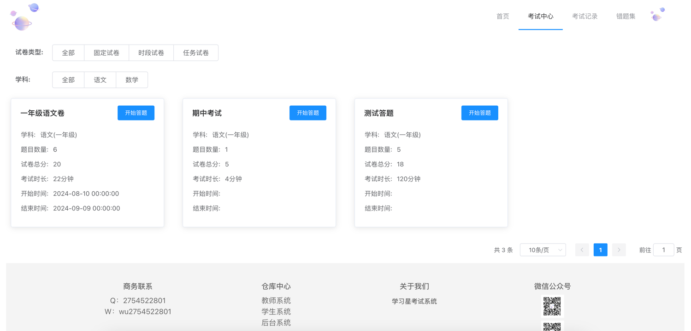
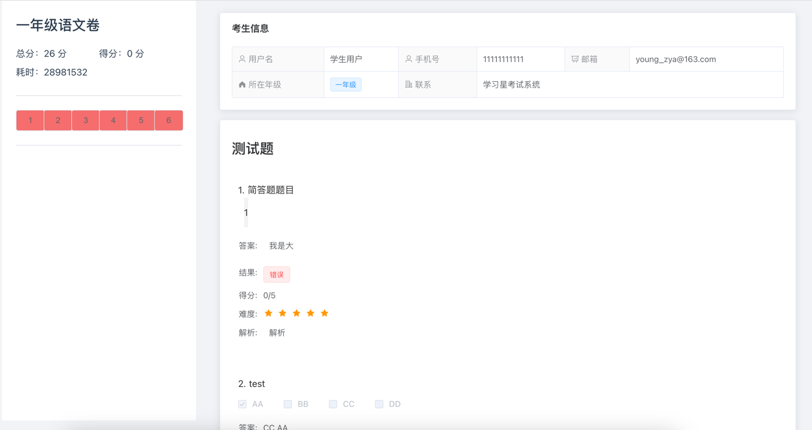
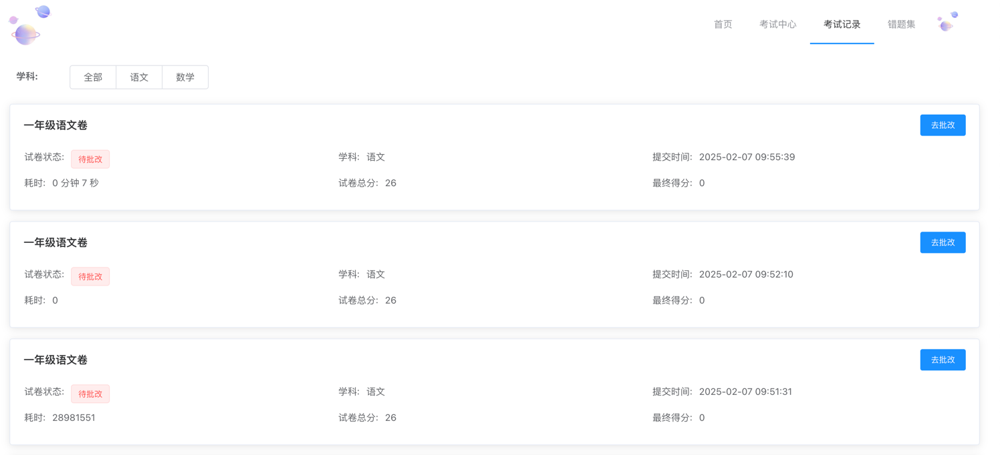
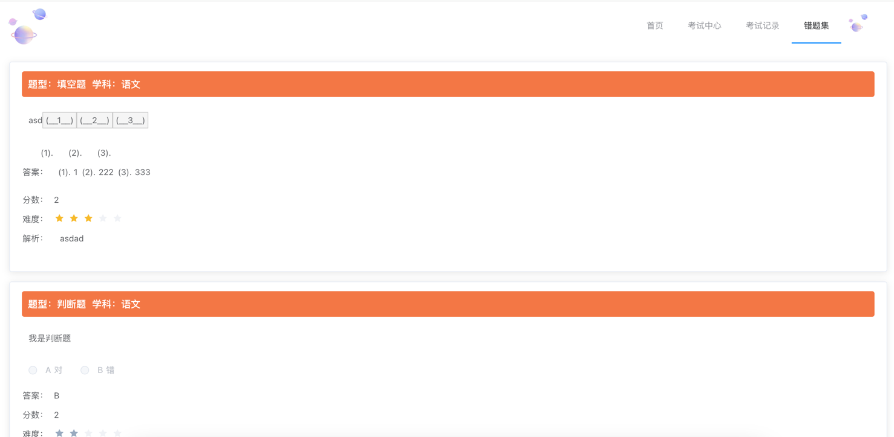
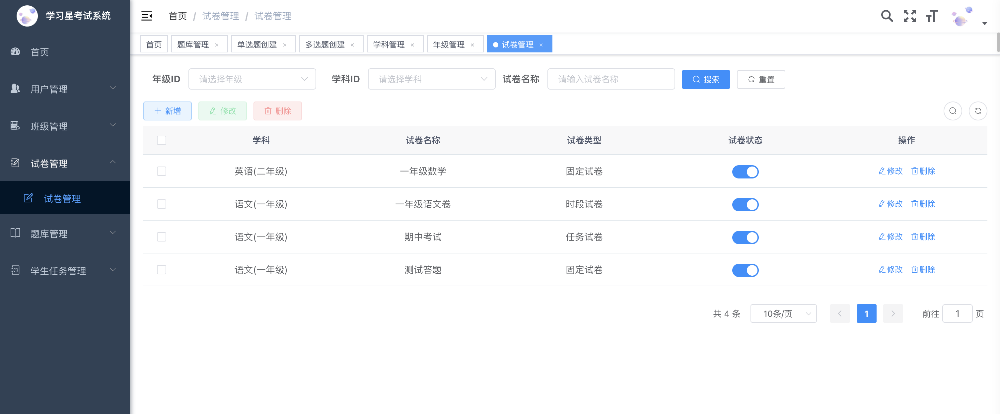
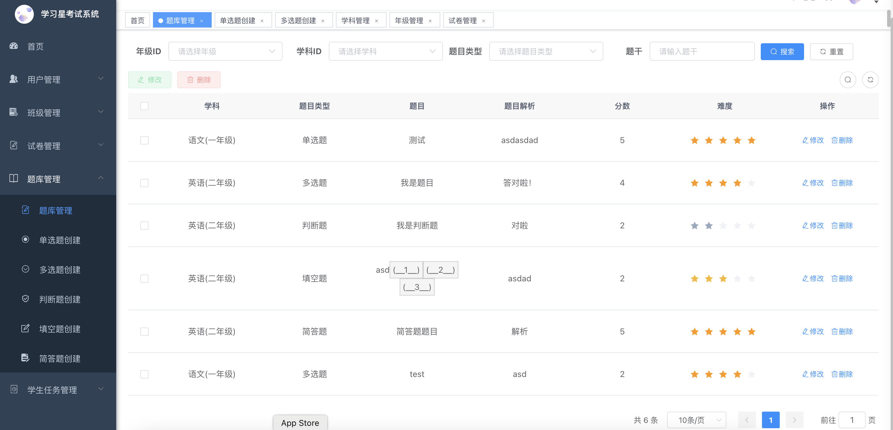
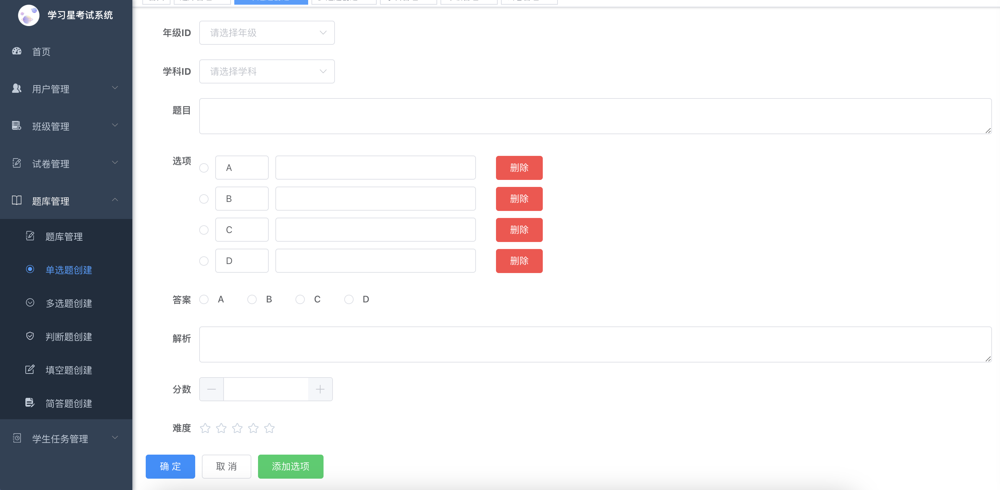
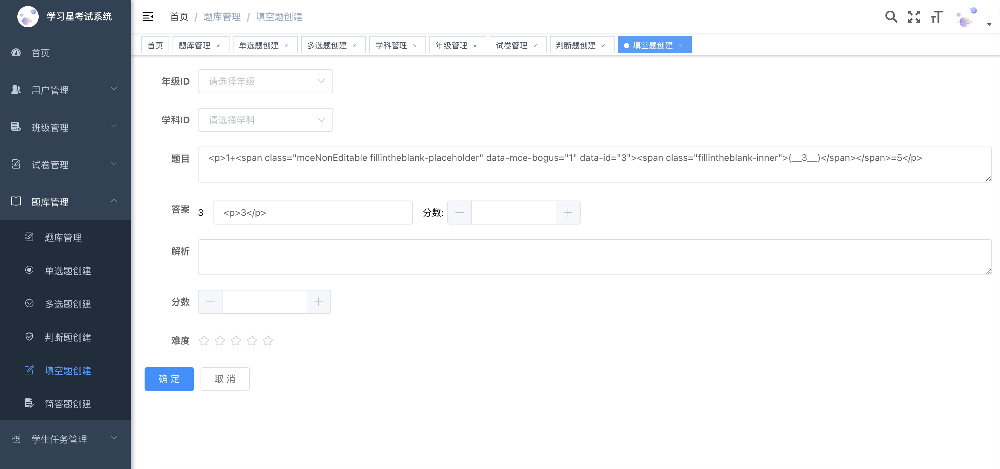

<p></p>
<p></p>

<p align="center">
<a href="https://gitee.com/wy521a/astar-education" target="_blank">
 
<a/>
</p>

<div align="center">

[](https://gitee.com/wy521a/astar-education)
[](https://gitee.com/wy521a/astar-education)
[](https://github.com/wu2754522801/astar-education)
[](https://github.com/wu2754522801/astar-education)
[](https://img.shields.io/github/license/wu2754522801/astar-education)

</div>

# 学习星开源考试系统

## 项目介绍

#### 项目概述：

学习星在线考试系统是一款基于Java和Vue.js构建的前后端分离的在线考试解决方案。它旨在为教育机构、企业和个人提供一个高效、便捷的在线测试平台，支持多种题型，包括但不限于单选题、多选题、判断题、填空题、问答题等，并特别增强了对数学公式的支持。

#### 技术栈：

- **前端**：使用Vue.js框架进行开发，提供了良好的用户体验和响应式设计。
- **后端**：采用Spring Boot框架，简化了服务端的开发工作，提高了开发效率。
- **数据库**：MySQL用于存储考试相关的数据，如试题库、用户信息、成绩记录等。
- **其他技术**：系统还集成了诸如tinymce等技术来支持数学公式的输入与显示，确保在创建包含复杂数学问题的试题时能够准确无误地展示给考生。

#### 版本要求
- **JDK**：>=`1.8`
- **Mysql**：>=`8`，`5.7`未验证
- **NodeJS**：>=`16`
- **VUE**：`2`

#### 主要功能：

- **题库管理**：支持丰富的题型，尤其是对数学公式题目的支持，允许教师上传并编辑含有数学符号的问题。
- **试卷生成**：教师手动选择题目组成试卷。
- **自动评分**：对于客观题（如选择题），系统可以实现自动化评分；而对于主观题，则支持人工批改。
- **成绩统计**：系统能够实时统计考试成绩。

#### 特色亮点：

- 支持数学公式是此系统的一个重要特性，使得它非常适合于数学、物理、工程等相关学科的在线教学和考核。
- 前后端分离架构提高了系统的可维护性和扩展性，同时也让开发者更容易针对不同的客户端（如PC端和移动端）进行优化。

# 开源许可声明

学习星系统开源版根据GPL-3.0协议进行发布，旨在促进技术交流与学习。我们鼓励基于本项目的改进和扩展，但严禁将任何修改或衍生的作品以闭源商业软件的形式发布、销售或用于其他商业目的。

若您希望在商业环境中使用本产品，并计划执行任何包含但不限于集成、部署或分发等商业化行为，请务必预先联系我们的项目负责人获取相应的商业授权。此举是为了确保您的使用行为符合GPL协议的规定，从而保障您能够合法、合规地利用本系统。

感谢您的理解与合作！

# 演示地址

* 教师端系统：http://124.221.91.143:1025
* 学生端系统：http://124.221.91.143:1026

# 仓库地址
gitee
* 教师端系统：https://gitee.com/wy521a/astar-education-ui
* 学生端系统：https://gitee.com/wy521a/astar-education-student-ui
* 后端系统：https://gitee.com/wy521a/astar-education

github
* 教师端系统：https://github.com/wu2754522801/astar-education-ui
* 学生端系统：https://github.com/wu2754522801/astar-education-student-ui
* 后端系统：https://github.com/wu2754522801/astar-education

# 环境部署

### docker-compose快速部署
```shell

git clone https://gitee.com/wy521a/astar-education
cd astar-education
docker-compose up -d
```
教师端系统：ip:port:1025

学生端系统：ip:port:1026

# 系统展示

* 学生考试系统
<table>
    <tr>
        <td></td>
        <td></td>
    </tr>
    <tr>
        <td></td>
        <td></td>
    </tr>
    <tr>
        <td></td>
    </tr>
</table>

* 后台管理系统

<table>
    <tr>
        <td></td>
        <td></td>
    </tr>
    <tr>
        <td></td>
        <td></td>
    </tr>
</table>

# 鸣谢

感谢若依框架提供快速开发脚手架项目
<a href="https://gitee.com/y_project/RuoYi-Vue">RuoYi-Vue</a>

# 联系

* QQ交流群：`978034227`
* 商务QQ：`2754522801`
* 商务微信：`wu2754522801`
* 微信群：`联系作者`

<table>
    <tr>
        <td>WX</td>
        <td>QQ</td>
    </tr>
    <tr>
        <td></td>
        <td></td>
    </tr>
</table>